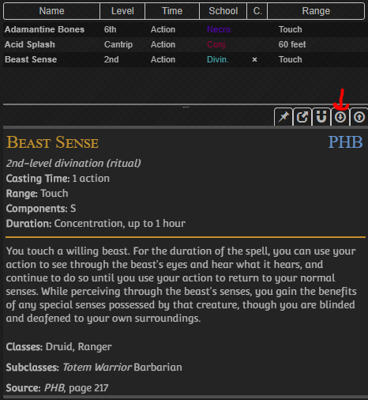

# 5eTools 2 Crobi Card
Whipped up a 5eTools to Crobi Card convertor in python for a weekend project. 5e Tools' Json Source files are not provided.

Crobi's RPG Card generator can be found [here](https://crobi.github.io/rpg-cards/)

# Basic Usage
1. Place 5e tools spell source json files into the master_spell folder.
File should look a bit like this
```json
{
"spell": [
    {
        "name": "spells go here"
    }
]
}
```
2. Place 5e tools spell list json in the root folder and keep it names spells-sublist.json. File should look like this
```json
{
	"items": [
		{
			"h": "adamantine%20bones_bols%203pp"
		},
		{
			"h": "acid%20splash_phb"
		},
		{
			"h": "beast%20sense_phb"
		}
	],
	"sources": [
		"BoLS 3pp",
		"PHB"
	]
}
```


3. enter the command `python tool.py` on a command line in the root directory

# Advanced Usage

## Flags
`-s` or `--source` allows you to change the source directory  
`-i` or `--item` allows you to change the default file name for the spell list  
`-f` or `--itemfolder` allows you to set the folder for batch processing spell lists  
`-u` or `--useitemfolder` batch process from the default batch folder `party`
